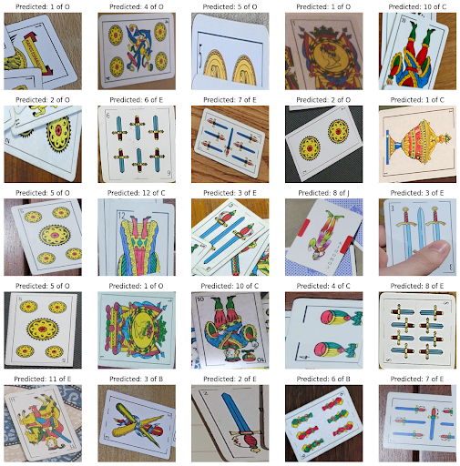
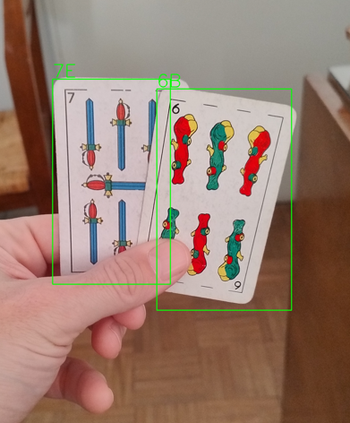

# Trabajo Práctico Final

Este trabajo práctico consiste en la entrega final de la materia Computer Vision de la Tecnicatura Universitaria en Inteligencia Artificial

## Introducción

El objetivo de este trabajo consiste en el desarrollo de un modelo de detección de objetos sobre un dataset de cartas españolas. El dataset deberá ser creado por los alumnos, por lo que debemos coordinar para utilizar los mismos estándares de anotación

La finalidad del modelo es el de ser utilizado para el juego de Truco Argentino. Se decidió utilizar un método two stage para la detección y clasificación de las cartas. Se utilizó YOLO para el modelo detector y transfer learning con un modelo de MobileNet para el clasificador.

### Herramientas de anotación

Se utilizo [labelme](https://github.com/wkentaro/labelme) como software de anotación de datos. Los estudiantes se pusieron de acuerdo de usar el mismo formato para las anotaciones, tanto como para el criterio de definir los bboxes como para los índices de la clasificación

Luego, se utilizó labelme2yolo para transformar las anotaciones a formato YOLO.

### Dataset

Como mencionamos anteriormente, los alumnos se encargaron de construir el dataset. Cada uno anotó sus propias imágenes.

Como el método elegido para el modelo es two-stage, es decir, detección y clasificación en dos etapas, debemos entrenar dos modelos.

Para el modelo detector, simplemente se establecieron todos los labels con un índice 0, es decir, solo se detectan cartas.

Para el modelo clasificador, se entrenó un modelo en tensorflow que usa como backbone MobileNet que tiene como salida una capa densa que clasifica el número y otra que clasifica el palo de la carta.
Para el dataset, además de utilizar los recortes de las imágenes de los alumnos, para darle mas robustez, este se aumentó de manera artificial usando fotos tomadas de cartas en alta resolución, recortadas y rotadas con background aleatorio.

## Instrucciones

Dentro de este directorio se encuentra el pdf TP-Final_CV-Enzo_Ferrari que documenta todo el proceso del desarrollo del modelo. Además, se encuentran las carpetas models, notebooks y scripts que contienen los modelos resultantes y el código con el cual se desarrollaron.

## Imágenes

